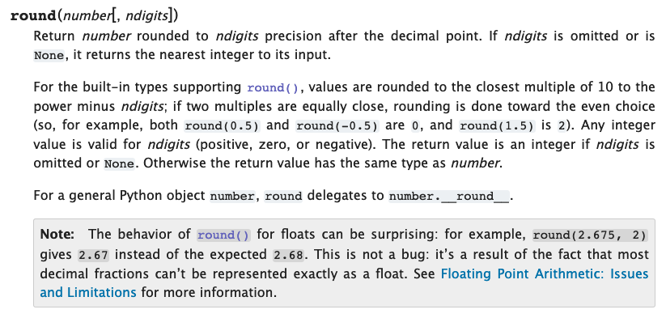
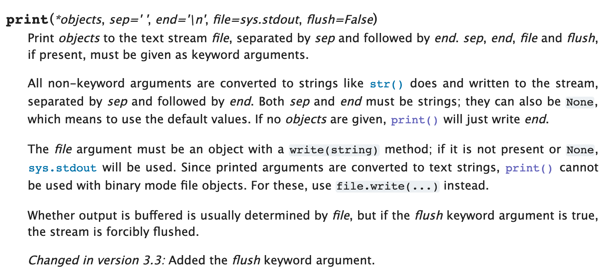

## What is a Function?
In the last lesson, we used the print function to print out the value of a variable, but we talked about what a function actually is. Functions are useful bits of code, written by someone else, that we can drop into our programs. We can think of them as building blocks for our programs that we can use to perform complex behaviours without having to reinvent the wheel ourselves. For example, the `len` function can be used to find the length of a string. 

Most of the time, a function will take some kind of data that it needs to do its job (input), perform some processing, and produce some result (output). For example, the `len` function takes an iterable such as a string as input, counts the number of elements in the iterable and outputs the number of characters.

## How Do I Use a Function?

We can execute, or call, a function by writing its name followed by a set of parentheses containing a comma-separated list of the values we want to pass in as input. When a function produces output, which we often call a **return value**, that value is substituted in place of the function call. It's very common for us to capture that return value by assigning it to a variable that we can reference later:

```
greeting = 'Hello World'
greeting_length = len(greeting)
print("The length of our greeting is: ", greeting_length)
``` 

<div class="aside" markdown="1">

### A Closer Look

A few things to note about this code: 
1. The print function will take as many inputs as we want to give it. When we do that, it will print each one after the other. 
2. Recall that as the script is executed, each function call will be evaluated and replaced with it's return value. Python will always evaluate expressions in an inside-out order, so we can pass the result of a function call as an argument to another function. So, instead of saving the length of the string in a separate variable, we could pass that expression directly to the print call: 

```
greeting = 'Hello World'
print("The length of our greeting is: ", len(greeting))
```
 
</div>

## What Input Does a Function Take?

The best way to learn about any function is to refer to the [Python documentation](https://docs.python.org). This documentation describes everything contained in the Python language, including a section on the [built-in functions](https://docs.python.org/3/library/functions.html) that come with the language out of the box. 

### Function Arguments

The formal name for inputs we pass to a function is **arguments**. When each function is created, it defines a list of the various arguments that it can take. The way that these arguments are defined is important as this is how the function determines which arguments are required, and which ones are optional, and the order in which you should pass them. Let's take a look at the `round` function go get an example of how this works:



Here we can see that the round function takes two arguments, one called `number`, and one called `ndigits`. Here's some python code that uses this function: 

```
rounded_value = round(12.3456, 2)
print(rounded_value)
``` 

This code prints the following: `12.35`. 

The function takes the `number` and rounds it to the number of decimal places specified by the `ndigits` argument. Note that the order here is important. The first argument we pass will be used as the `number` argument, and the second will be the `digits` argument. 

The first argument, `number` is and example of a required argument. Typically, if any arguments are required they are listed first. In this example, we can see that it is required because it is listed as a plain argument without any special symbols around it. So you could say that arguments are required by default unless specified otherwise. In contrast to this, the `number` argument is an optional argument, which is signified by the square brackets surrounding it. 

Another way we could use the round function is by specifying the name of the arguments as we call the function: 

```
value = 12.3456
rounded_value = round(number=value, ndigits=2)
print(rounded_value)
``` 

When we do this, we say that we're using *named arguments*. When you use named arguments, we don't have to follow the order described in the documentation, so we could get the same result using the following code:

```
value = 12.3456
rounded_value = round(ndigits=2, number=value)
print(rounded_value)
``` 

For a more complex example, let's take a look at the documentation of the [print function](https://docs.python.org/3/library/functions.html#print):



Here we see that first argument this function takes is called `objects`. You might also notice that `objects` listed with a asterisk, which signifies that we can provide multiple values for this argument. This argument is a bit greedy. It will gobble up any non-named arguments that we pass at the beginning of our function call. We can see that there are also a other arguments listed, such as the `sep` and `end` arguments. One thing that's a bit different here is that these arguments include a default value, which is specified by an equals sign and the value that it will have by default. This is another way of showing that an argument is optional. If the argument isn't supplied when the function is called, the function will use the default value.

Since we've got that greedy `objects` argument, the only way we can specify the `sep` or `end` arguments is by passing them as named arguments:

```
print("These are my favourite fruit:")
print("Cherries", "Apples", "Bananas", sep=", ", end="!\n")
```                                                                                 

## Creating Your Own Functions

A common mantra among programmers is *"Don't repeat yourself"*. The whole idea behind this concept is that we should avoid writing the same or similar code over and over. Why? Because sooner or later your code will have a bug, or need to be changed. And when you've repeated that code 75 times across 50 code files it can be really difficult to track down and fix every copy of that code. If ever realize that you've missed even one of those 75 then you've got to spend the time to go through and check every single one. What a waste!

As we've already seen, one solution is to use loops, which works in specific cases, but writing your code as a function is the most flexible solution to this problem. That way you can write a function once and use it all through your code. Let's look at an example using our code for temperature conversions:

```
def fahrenheit_to_celcius(temp_f):
    temp_c = (temp_f - 32) * (5 / 9)
    return temp_c
```   

Let's take a closer look at this code: 
* `def` in the first line stands for define. This indicates that we're about to define a new function. 
* `fahrenheit_to_celcius` is the name that we've chosen to give our function. The name is arbitrary, but must follow some basic rules just like a variable name: 
    * They must start with a letter or an underscore.
    * They can have numbers
* As we've already seen from the other function documentation, the variables in between the parentheses indicate the input that our function expects to receive. 
* The function definition line must end with a colon. 
* Just as we did with our loops and if statements, we use indentation to define where the code for our function begins and ends. 
* The last line includes the return keyword. Whatever comes after it will be the output of this function. This returned value can be captured by assigning it to a variable when calling the function. 

Now that we've got our function defined, let's take it for a spin: 

```
temp_c = fahrenheit_to_celcius(32)
print(temp_c)

temp_c = fahrenheit_to_celcius(78)
print(temp_c)

temp_c = fahrenheit_to_celcius(1000)
print(temp_c)
```


0.0
25.555555555555557
537.7777777777778


And now we can put it together with our looping example: 

<details class="aside" markdown="1">

<summary>
Modify our temperature conversion loop from the control flow lesson to use our new function:

<div markdown="1">

```
# Start With: 
temps_in_f = [72, 62, 68, 100]

temps_in_c = []
for temp in temps_in_f:
    temp_c = (temp - 32) * (5/9)
    temps_in_c.append(temp_c)
    
print(temps_in_c)
```

</div>

</summary>

Solution: 

```
temps_in_f = [72, 62, 68, 100]

temps_in_c = []
for temp in temps_in_f:
    temp_c = fahrenheit_to_celcius(temp)
    temps_in_c.append(temp_c)
    
print(temps_in_c)
```

</details>

