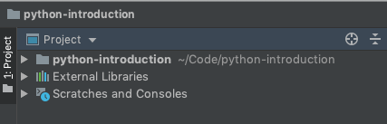
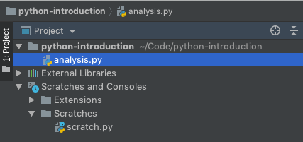
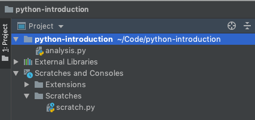
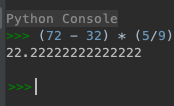
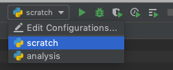

Now that we've got our project set up in PyCharm, it's time to familiarize ourselves with the PyCharm interface. 

The PyCharm interface is divided into a number of panels. Let's start by digging a little deeper into a few of them. 

## The Project Pane

The left most pane in is the project pane, the main way that we'll organize and explore the files that make up our project. Right now, our project doesn't include any files, so there's not much to see. Let's fix that by adding a few files:

In the project pane, right click on the folder, *pycharm-introduction* and select *New* > *Python File*. 

PyCharm will then ask us to give our file a name. Let's call it "analysis.py". As we work through our lessons today, this file will be the script we'll do our data analysis in.

Let's create one other file before we move on, a scratch file. A scratch file isn't really intended to be a part of our final project. Instead they're temporary files where we can write and test our python code without risk of ruining the work we've done so far.

Again, right click on the folder, *pycharm-introduction* but this time choose *New* > *New Scratch File*. PyCharm will then ask us what kind of scratch file we'd like to create. As you can see, while PyCharm is a Python IDE, it's able to work with a very wide variety of file types and languages. Find *Python* in this list and select it. Note that you can type to narrow down the list of options.

Now that we've got a couple of files added to our project, the project pane has updated accordingly:

You can think of the project pane as your file explorer on Windows, or as a Finder window on the mac. We can do all the same things including creating directories, renaming, and moving files. 

### How Should I Organize My Files?

While you can do all of your work in a single python file, for larger projects this can get unwieldy and difficult to navigate. For that reason, it's often a great strategy to break your code up into different files. When you do this, it's common convention to group your code into files that serve a similar purpose. For example you might have all the code dedicated to cleaning data in one file, analysis in another, and visualization in a third.

## Editor

Now that we've added a few files to our project, we can start editing the contents of those files in the editor pane. You can have multiple files open in the editor pane at once, allowing you to quickly jump between files. Along the top of the editor pane you should have two tabs, one for each file we have open, our analysis.py file and our scratch file. 

You can close any of these tabs by clicking the *X* in the tab. To open a file in the editor, just double click it in the project pane. 

The editor will automatically adjust to the file that we're editing. So if we're editing a Python file, it will provide syntax highlighting, code-completion, and style suggestions specific to the Python language. 

Let's write our first line of Python code. In our scratch file, let's add a single python expression: 


(72 - 32) * (5/9)


Notice how some  parts of our expressions are coloured differently than others. This is an example of syntax highlighting in action. For this small example it doesn't seem to add much, but syntax highlighting is an important part of any IDE. Once you internalize the rules of the syntax highlighting, it help to make code more readable and will even help you to identify mistakes and typos in your code. 

## Python Console

Along the bottom of the PyCharm window are a couple of other tabs. Let's dive in to a few of them, starting with the Python Console.

The Python Console is a command line interface to a self-contained Python environment. It serves a similar purpose to our scratch file above, allowing us to do little experiments with small snippets of Python code.

The console is completely isolated from the code that we run in our Python scripts, so you can feel free to experiment without fear of ruining your other work. Let's write the same expression from our scratch file into the console and push **enter**.


(72 - 32) * (5/9)


As you can see as soon as we push enter, our code is run immediately and the console prints out the result for us: 

There is one fundamental difference between the Python console and running python code in our files and running code in the console. When we run code in our files above, we run all of the code in the file at once, the Python environment that code runs in only exists while the file is running and then it disappears. In the Python console, the Python environment lives on, and we can run code one line at a time. If we want to start in a fresh environment, we have to click the rerun button  at the top left of the console.  

The nice thing about the Python console, is that it allows us to see and explore the data that we've created in our console. This way we can get a detailed look at our data as our code is running. We'll see this in action in a little bit.

## Terminal

The terminal panel gives us quick access to the command line interface for your operating system. On Windows, the terminal tab gives you a command prompt, while on Mac you'll get a terminal. Since we went through the trouble to set up our project as a Conda environment, the terminal has already been set up to work in our local project. That means that we can use the `conda` and `pip` command line tools to quickly download and install additional software.  

## Running Code in PyCharm

We can run code a few different ways in PyCharm. The first, which we've already seen is the python console. 

The other way we can run code is by executing one of the files that belong to our project. We do this by setting up a *Run Configuration* for our project. You can do this by hand, but the easiest way is to let PyCharm set things up for us:

1. Make sure that your scratch file is open and active in the editor pane. 
2. In the menu at the top click *Run* and choose *Run*
3. Click *scratch*

The code in your scratch file immediately runs and a new panel is opened at the bottom of the IDE, called *Run*. Here we can see the results of our running script. In our case, this script doesn't produce any output, so we don't see much. 

We can repeat the same process for our analysis file to set it up as well. 

Once we've got our files set up, you can use the run configuration menu to easily run your code. Just select which file you'd like to run from the dropdown and click the green arrow to run it. 

You can also push `CTRL + R` on your keybaord to run whatever file is selected in the run configurations dropdown.
