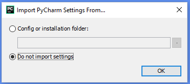
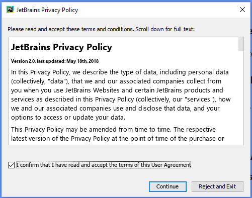
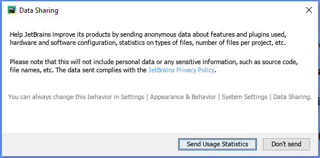
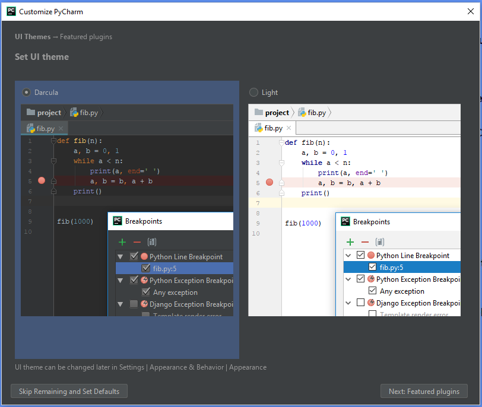
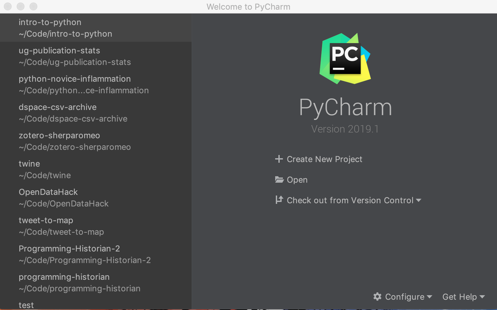
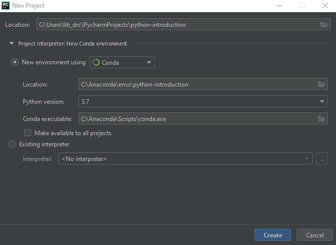

Before we can get started, we have to set up our PyCharm editor, which we will use to write and execute our Python code. 

## What is PyCharm?
PyCharm is what we call an *Integrated Development Environment* or *IDE*. IDE's make it easier for use to do work in python by offering a lot of functionality that's useful for Python development all in one convenient application. 

Working in an IDE might seem intimidating at first, but there's a lot of advantages to using a good IDE:
* All of your tools are in one place
* Syntax highlighting makes code easier to read
* Code completion helps you type less
* Linting tools can help you improve the quality of the code you write
* Integrated debugging tools make it easy to step through your code line by line

## First Time Setup

The first time you launch PyCharm it will ask you to go through a few setup steps: 

### Import Settings From Previous Versions of PyCharm

Since we've never run PyCharm before, choose *Do not import settings* an click **OK**.

### End User License Agreement (EULA)

In order to use the software we need to agree. Check *I confirm that I have read and accept the terms of this User Agreement* and click **Continue**.

### Data Sharing

This is up to you. I'll choose **Don't send**. 

### Pycharm Customization

Again, this is your choice. Pick the theme that appeals most to you. 

We have the option to install additional plugins to extend the functionality of PyCharm itself, but for now we don't need any extra plugins. Click **Skip Remaining an Set Defaults**. 

## Starting a New Project
Now that we've done our initial setup it's time to set up our project in PyCharm. Whenever you start PyCharm you'll be greeted with the following screen: 

On the left, there will be a list of recent projects that you have worked on. On the right, we're presented with three options: 
* Create New Project
* Open
* Checkout from Version Control

If you've never used PyCharm before, you won't have any recent projects listed on the left. We want to add a new project for our workshop today. Click *Create New Project*.

Create a New Project
1. Give your project a directory. I'll leave my path as default and call my project "python-introduction"
2. Expand the *Project Interpreter* section
3. Select *New environment using* and make sure the dropdown says Conda
5. Click **Create**

Starting a new project
* Create new project
* Add a new script file
* Introduce the PyCharm UI
    * The project explorer
    * The editor pane 
    * The python console
* Running Python code
    * The console
    * Running a script
    
    

In the python console, enter the following and push the **return** key. 

(72 − 32) * (5/9)


