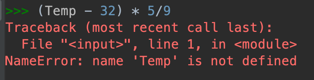
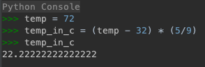

Our first line of python code is useful in a specific way, but isn't useful otherwise: 

```
(72 − 32) * (5/9)
```

This code does one thing: It converts 72 degrees Fahrenheit to Celsius. That's great! But what happens when we want to convert another temperature?

## Python Basics: Variables

Variables are a fundamental part of programming. They allow us to make our code generic, so that it can easily be reused. 

In python, we can define a variable by giving it a name, and assigning some value to it using the assignment operator, the equals sign:

```
temp = 72
```

This statement defines a new variable, which we have called temp. We can name a variable anything we want as long as it conforms to some basic rules: 
1. The name must be made up of letters, numbers, and underscores
2. The name must not start with a number

Anywhere we write python code, we can now use our variable name, and the python interpreter will automatically substitute the value that we have assigned to the variable in its place:

```
temp_in_c = (temp − 32) * (5/9)
```

<div class="aside" markdown="1">

**Note:** Variable names are case sensitive, so if in the code above we were to refer to temp with a capital T, it would produce an error: 



</div>

<div class="aside" markdown="1">

### What's in a variable? 

In the python console, you can print the value of a variable by writing its name: 



In your python script files, you can use the `print` function to print the value of a variable:

```
print(temp_in_c)
```

</div>

### Variable Types

Variables in python have a type associated with them, which affects how python will handle the value that they hold. The most common types that you'll encounter are: 
* Integer (Whole numbers for example: -1, 5, 15)
* Float (Fractional numbers for example: 1.5, -0.00003, 1111.22)
* String (Text data for example: "Hello", "World")

In our code above, the `temp` variable has a type of 'integer'. Python determines the type of the variable by considering the value that we assign:

``` 
temp = 72
```

Here, `temp` will have an integer type because we've assigned a number without decimal places. 

```
temp2 = 72.0
```
 
Here, `temp2` will have a type of float because we've assigned a value with a fractional component. 

```
word = "Banana"
```

And here, `word` will have a type of string because we've assigned a value wrapped in quotes.

<div class="aside" markdown="1">

#### Quotes in Python

There are two types of quotes in python:
* The single quote, for example: `'Banana'`
* The double quote, for example: `"Banana"`

Python supports both of these quotes and treats them interchangeably. From a data perspective, `'Banana'` is identical to `"Banana"`.

Both kinds of quotes are supported so that we mix them when we need to. This lets us do things like `dialogue = 'Mary asked "How are you feeling today?"'`

</div>

### Modifying a Variable

If we ever want to change the value of a variable, all we have to do is use the assignment operator to give it a new value: 

```
temp = 82
``` 

### Variables Store Values, Not Expressions
When a variable is assigned a that is the result of a more complicated expression, it only stores the result of that expression. For example, in our temperature conversion code:

```
temp = 72
temp_in_c = (temp − 32) * (5/9)

temp=32
print(temp_in_c)
``` 

When python evaluates a script it does so by reading the script line by line from the top to the bottom. As it does this, it keeps a running 'state' of all of the variables that have been declared and their values. When the variable `temp_in_c` is assigned only takes the value of the expression resulting from the current state. It evaluates the expression on the right side of the assignment operator, and then assigns the result to our new variable, `temp_in_c`. 

While we've modified `temp` before printing out `temp_in_c`, `temp_in_c` does not change because it only stores the result of the expression, not the expression itself.

### Operations with Variables

In our temperature conversion code above you can see we're working with numeric types (floats and integers), which means we have the usual suite of mathematical operators to use when manipulating these variables. When I introduced the concept of variables, I mentioned that Python will handle different types of variables in different ways. For example, if we have two string variables, we can still add them together using the `+` operator. However this time, Python knows to treat these variables as strings, not numbers, so we get a different result:

```
result = "Hello" + "World"
print(result)
```

Will produce: 

`HelloWorld`

### Lists

A list is a way for a single variable to store multiple values. Let's define a list of temperatures that we'd like to convert: 

```
temps = [72, 70, 68, 110]
```

Individual elements in a list don't have to all have the same type, so if you wanted you could define a list such as: 

```
temps = [72, 70, 68, "orange"]
```

Though in practice, you don't end up doing this too often since having lists of the same type of objects makes it easier for us to write code to process all of the list elements in bulk. 

When we have a list, we can access individual elements of it by their position in the list, which we call their *index*. In python, it's important to remember that indexes always start counting at 0, so the first item has index 0, the second has index 1 and so on. We can access an item in a list using the indexing operator:

```
first_item = temps[0]
last_temp = temps[3]
```

We can update a list item the by assigning a new value a new value to the index:

```
temps[0] = 75
```

We can also subset our list by using something called slicing, which lets us subset our list: 

```
front_half = temps[0:2]
back_half = temps[2:5]
```

When slicing we provide the start and end indices separated by a colon. It's important to note that the list slicing does not include the last element. So in the code above where we use the slice `0:2` it will return the list items at index 0 and 1.

When we're slicing from the beginning of the list or to the end like we are above, we can leave out the start or end index and python will just assume that we want to start at the beginning or end at the end.

```
front_half = temps[:2] # Equivalent to [0:2]
back_half = temps[2:] # Equivalent to [2:5]
```

<div class="aside" markdown="1">
#### Strings as Lists

Python lets us treat strings as lists of characters so we can use the same indexing and slicing techniques to work with text data: 

```
greeting = "Hello World"
print(greeting[0]) # H
print(greting[0:5]) # Hello
```

</div>

### Other Variable Types

There are a lot of other types of variables that store more complex data and can be used for other types of calculations. For example, the datetime type can be used to store stores a date and a time. Once we have a variable of this type, we can use it to math with date, like asking what date it will be if we add 49 days from the current date and what day of the week it will be. 

For more information on all of the available variable types, refer to the [Python Documentation: Data Model](https://docs.python.org/3/reference/datamodel.html#objects-values-and-types)

